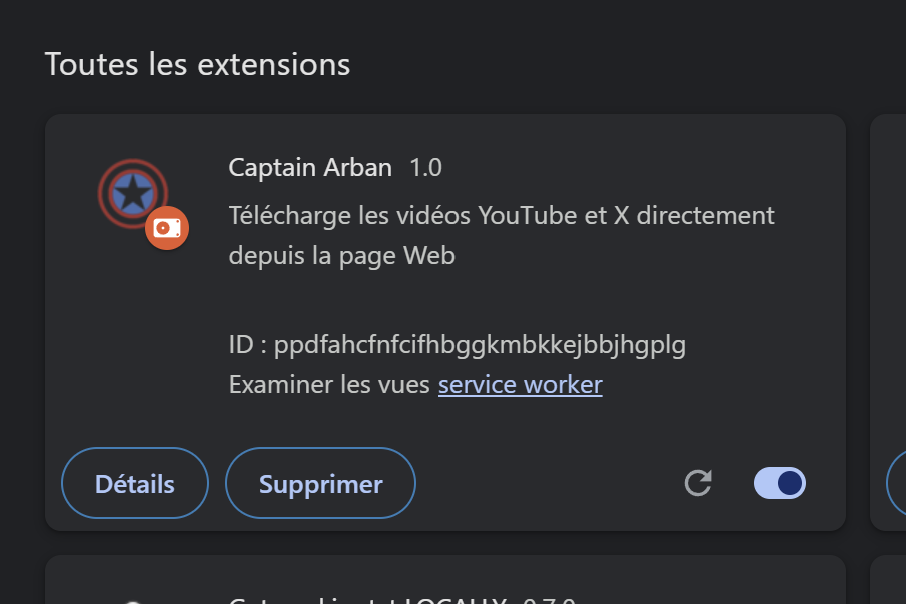
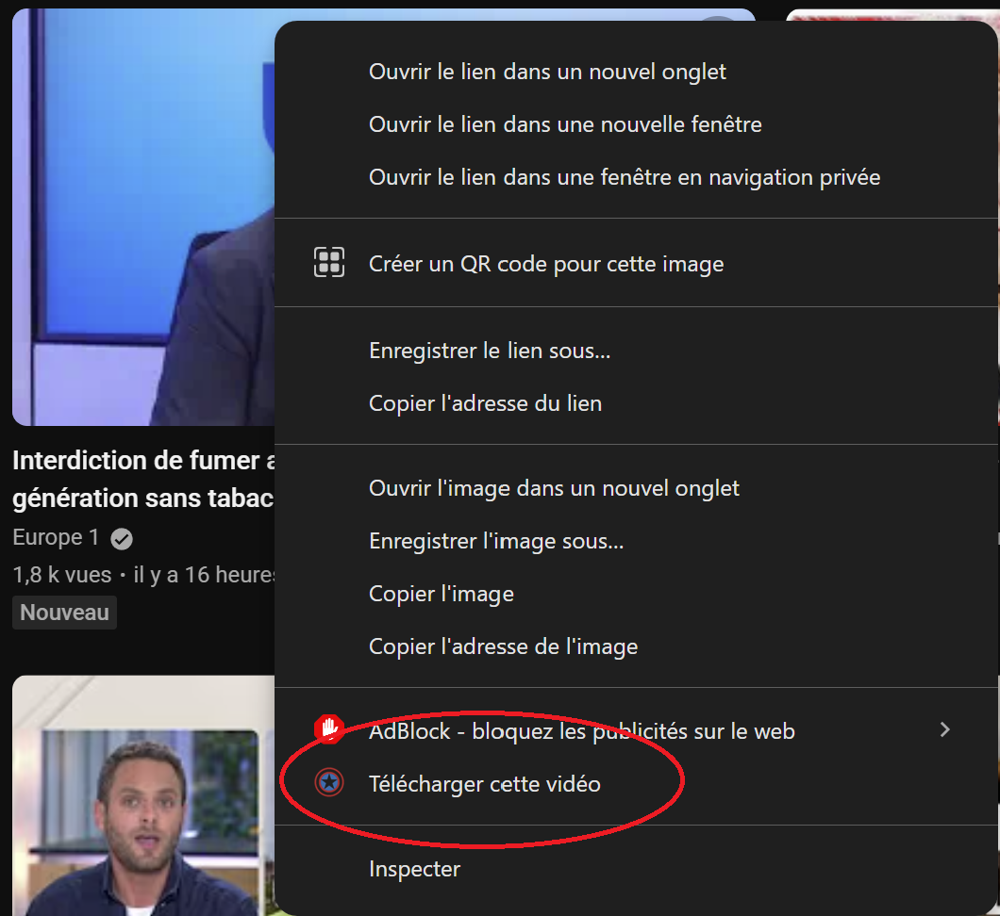
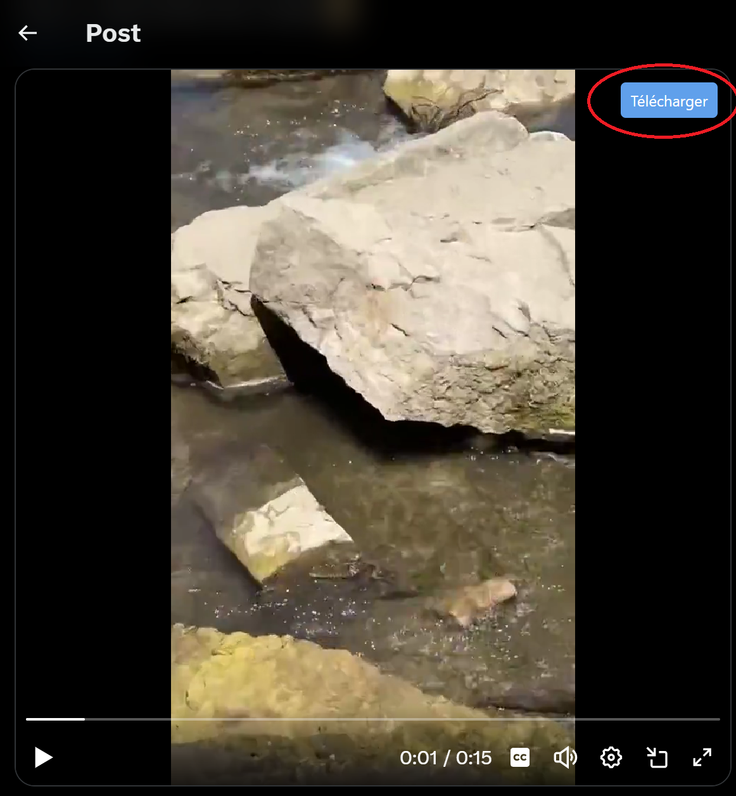

Captain Arban est une extension Google Chrome qui permet de télécharger des données multimédias sur Youtube, et Twitter (X). Lorsqu'elle est active, elle affiche un petit bouton sur les vidéos permettant de les télécharger par un simple clic.  
Sur Twitter, l'extension permet d'injecter un bouton "Télécharger" pour toutes les vidéos qui émergent dans le fil.  
Sur Youtube, on injecte un bouton sur les vidéos en lecture. De plus, il est possible de télécharger une vidéo par un simple clic-droit sur sa miniature.  

   
 

Elle est composée d'une partie Front-End (en Javascript), et une partie Back-End (Python-Flask).

L'extension a besoin d'être packagée pour être utilisée par n'importe quel utilisateur. Il reste la gestion des répertoires locaux. 

Il est prévu d'élargir l'extension vers d'autres réseaux sociaux.

