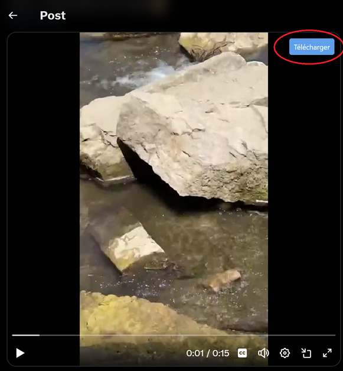

Captain Arban est une extension Google Chrome qui permet de télécharger des données multimédias sur Youtube, et Twitter (X). Lorsqu'elle est active, elle affiche un petit bouton sur les vidéos permettant de les télécharger par un simple clic.  
 

Elle est composée d'une partie Front-End (en Javascript), et une partie Back-End (Python-Flask).

L'extension a besoin d'être packagée pour être utilisée par n'importe quel utilisateur. Il reste la gestion des répertoires locaux. 

Il est prévu d'élargir l'extension vers d'autres réseaux sociaux.

